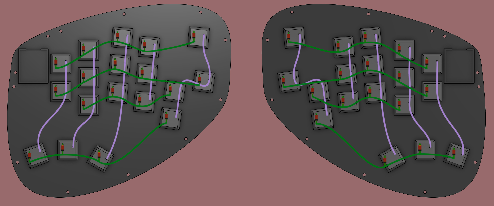
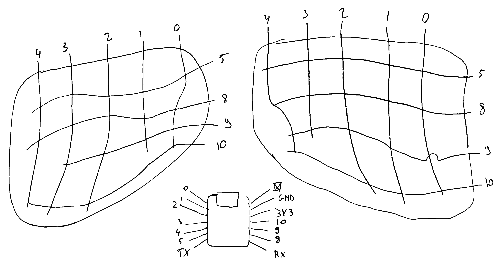

# Cobra Cadence build guide
|||--This page is still under construction--|||

> [!CAUTION]
> I'm writing this build guide, as well as the rest of this write-up while I'm away and don't have access to the keyboard. I might make some small mistakes, but these should be minimal. More likely, since I can't take new pictures, I'm relying on old pictures and some renders I can make while on the go.  
> It's not ideal but the best I can do right now. Feel free to open an issue on the [repo of this webiste](https://github.com/mreel/TiboLoete), and I'll do my best to fix it.

See the needed components [here](cc_main_page.md#Components)!

> [!CAUTION]
> This is my first handwired board, I made a lot of mistakes and learned a lot. This build guide is supposed to be less of a 'replicate this' and more of a 'learn from this' kind of guide. I'll be giving some commentary on things I did wrong and how to do them right.

## Step by step
### Overview
1. Get components  
2. Prep case with threaded inserts and embedded nut
3. Put switches in the plate  
4. Wire the matrix
5. Connect matrix to controller
6. Put plate assembly into case
7. Connect both halves
8. Close everything up
9. Put on keycaps

### Getting components
All the used components should be fairly easy to find online, with the exception of the case as it's 3D-printed. The print files can be found in the `hardware` folder.  
The top half and the plates can be printed without supports (the top should be upside down for printing), though the bottom needs support. Printing upside down would likely create cleaner results on the bottom (visible) part of the case, but I decided to print right side up as it's a world of difference in terms of printing time and material usage.  

### Prep case with threaded inserts and embedded nut
There's 12 screws per half, meaning 24 threaded inserts per half. They should be pushed in with a soldering iron, the plastic will reflow around the ribs of the inserts and they should be solid.
#### Top half
The threaded inserts in the top case are pressed in from the bottom, as they are not visible from the top. Make sure to get them (at least) flush with the bottom of the case, otherwise the case won't close properly.

#### Bottom half
Analogous to the top half, the threaded inserts are pressed in from the top, again make sure they are flush.  

The bottom half also features an embedded M2 nut, for locking the connecting wire between halves in place. In theory it you could just drop in it in the slot, in practice it might need either some percussive persuasion or glue.

### Put switches in the plate  
Simple enough!  

### Wire the matrix
Now comes the ~~fun~~ ~~annoying~~ <ins>exciting</ins> part!  
Wire the matrix according to the wiring diagram below, remembering to put diodes in between the switch and the row wires, with the black part of the diode facing away form the switch.  

The wiring might look a little funky, that's because it is. The microcontroller only has 11 GPIO pins, two of which pull double duty as the UART RX and TX pins, leaving only 9 usuable pins for the rows and columns. For this reason the _mash!_ keys are —electronically— on the same row as the top of the main cluster, except for the pinky column. It's weird, but can be —and is— fixed in the firmware.  

  
It won't look this nice in real life

### Connect matrix to controller
This is the more tricky job, as noted before, I didn't get the presoldered header pins, you should, it should be a lot easier.  What I didn't realise keyboard firmware (at least KMK) assumes mirrored/symmetrical wiring, I didn't do that, I wired them so the leftmost and topmost column and row respectively correspond to the lowest number. I do not recommend this, as such I won't be showing a fancy diagram like I did for the matrix wiring.  I do have a pencil sketch from when I was building the board that I'll clean up a little for those who wish to be stubborn or want to use my firmware as is.

  

### Put plate assembly into case
It's time to put the assembly into the bottom halves of the case. In the next step it will become very obvious why I won't be connecting two halves of a board in the same way in the future.  

### Connect both halves
### Close everything up
### Put on keycaps