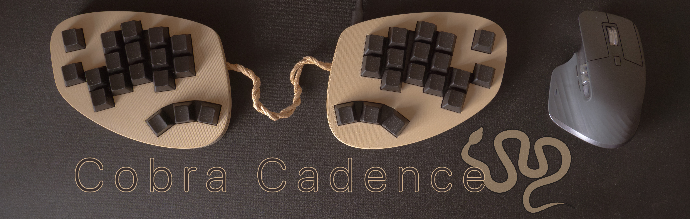

---
The Cobra Cadence is a 36-key, handwired split keyboard with a unique layout.

**Key features:**  
- Slightly splayed columnar-staggered layout
- 4×3+2 main cluster
- 2×3 thumb keys
- 2 'mash' keys
- KMK firmware

{pictures}

## Design
### Layout
With this keyboard I wanted to take the principle of 'never more than 1u away from the homerow' very seriously, but also wanted to keep a few easily mashable keys, namely escape and play/pause. It's just fun to mash 'em.  
To that end, there's only two keys on the inner column, I've never liked the inner column while typing so this was my change to make it just a bit smaller and keep those keys within even easier reach.  
On the pinky, I decided to go for an oddly placed upper row as I have very short pinkies. For my next keyboard I would likely go for a slightly more exagerated stagger instead.  

### Build
I went with a more organic shape for case for a few reasons. For one, with this layout, a tighter, more common angular design simply didn't look good. I also felt that ergonomic keyboards in general are meant to line up with our biology more closely, to be more organic. The design should reflect that.  
The logo is based on the key layout, the snake's head is the 'mash' key, with the tail as the thumb cluster.
{logo->key graphic}

The case and plates are 3D-printed and the keyboard uses a [sandwich mount](https://www.keyboard.university/200-courses/keyboard-mounting-styles-4lpp7). The plate features a recepticle for the microcontroller to fit into. The keyboard is completely symmetrical and both halves are connected with a hardwired cable.

> [!TIP]
> All the files for this project can be found in this repo

## Components
### BOM

| Part | Quantity |  
| --- | --- |  
| Diode | 36 |  
| MX switch (Durock T1) | 36 |  
| Seeed Studio XIAO nRF52840 | 2 |  
| M2 threaded inserts | 48 |  
| M2 Nut | 2 |  
| M2 Screw | 26 |  
| Keycaps | 36 |  
| Wire† | ~3m? |  
| 3D-printed plate (L+R) | 1 |  
| 3D-printed case (L+R, top+bottom) | 1 |  

<!-- to do: add lengths to threaded inserts and screws-->
† I used the conductors from some ethernet cable I had laying around, worked great

### Component considerations
I was on a very tight budget for this build, because of this I used parts I had laying around as much as possible[^1]. I bought some stuff I didn't end up needing, in the end, the only things I bought new and used for this project were the microcontrollers and diodes.  
The controller was chosen for it's compactness, price, and most importantly, it's compatibility with both KMK and ZMK. Originally this was supposed to be a wireless build, but I realized a non wireless build was difficult enough with my current skillset. At the same time, I wanted to give KMK a try, since I'm pretty comfortable in python, and I never got comfortable using `c` for qmk[^2].

### Required Tools
- Soldering equipment
- FDM or Resin 3D Printer or at least access to one  
- Screw driver with the appropriate bit depending on your screws
- \[Recommended] Helping hands
- \[Recommended] Tweezers

## Firmware
Right now (as of 02/24), the firmware is written in KMK, I've got basic functionality down, but I'm not happy with it for multiple reasons. The main reason is just my laziness in not properly implementing everything I want[^3], but it also turns out I'm not a huge fan of KMK. I'm not in the business of bashing free and open-source projects, but let me quickly list why it's not for me personally:  
- Boot time: the keyboard takes multiple seconds to boot every time you plug it in. As far as I know this is a limitation of circuitpython and not something the KMK devs can do anything about. 
- Documentation: the documentation was mostly fine, if a little lacking in structure, but the documentation website has since gone down. The markdown files that the site was built on are still on GitHub, so technically the documentation still exists, but I'm not a software developer and I rely **heavily** on the docs. I just need a project with more dedication to the docs. KMK is a small project[^4], I don't blame them, documentation takes person-hours they just don't have to spare.  
- Support: This is all on me, but they use Zulip rather than Discord. I barely use Discord as is and don't want to add another service that I'm also never going to use. And again, it's a small project, I don't want to bother the same few people over and over again, they have other priorities.

Because of these reasons I've decided to transition to ZMK, this won't be done anytime soon for personal reasons.  

In other words, feel free to use the firmware as a starting point but don't expect it to be nice and frequently updated. Just drop the `kb.py` and `main.py` in the root folder of the drives, together with the `kmk` folder of the KMK firmware. For more information see [the docs](https://github.com/KMKfw/kmk_firmware/blob/main/docs/en/Getting_Started.md).

## Further reading
- [Build one yourself!](build_guide)  
- [The story](story)
- Firmware \[link required]

## License

The hardware is licensed under <a href="https://creativecommons.org/licenses/by-nc/4.0/?ref=chooser-v1" target="_blank" rel="license noopener noreferrer" style="display:inline-block;">CC BY-NC 4.0</a>

The software is licences under the [MIT licence]  <!-- TODO!--> 
In layman’s terms: You can use and modify the hardware for personal projects, but you can’t sell it. The software is free for anyone to use, modify, and even sell.

<!-- 
- reddit post: summary and pictures
- blog post on website: longer write-up, including a detailed explanation of stuff so it can be replicated
- github page: more firmware, 3d files etc
- BOM
- assembly guide
- firmware
- license (hardware and software)
- marketing?
- credit & attribution (zmk, kmk etc)
- all project files
-->

[^1]: My other, used-to-be 75%+10 macro keys board, the keebio sinc, now is more like a 55% from removing 36 switches.  
[^2]: I didn't want to give up compatability with ZMK in case I didn't like KMK, or if I wanted to convert it to a wireless board later.  
[^3]: A lack of motivation is the main culprit here, partly because my poor job of putting the board together make is <100% reliable. Reliable enough to use, but not enough to feel motivated to improve it.  
[^4]: In terms of forks on GitHub, about 1% and 10% the size of QMK and ZMK respectively.  